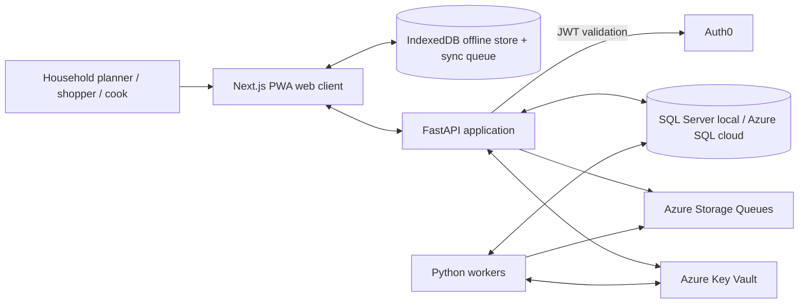

# Architecture Overview: AI-Assisted Household Meal Planner

Last Updated: 2026-03-07
Status: Draft for review

## 1. Purpose
This architecture turns the current constitution and PRD into a concrete delivery shape for the repository. It is intentionally opinionated where Ashley has already approved defaults and intentionally explicit about unresolved details that still need later feature-spec work.

## 2. Architecture Style
- **Overall style:** modular full-stack web product with a single web client, a single FastAPI backend, and background Python workers.
- **Delivery model:** monorepo-friendly structure with clear concern boundaries rather than microservices-first complexity.
- **State model:** the web client owns temporary UI state, offline cache, and a sync queue; the API and database own authoritative household state.
- **Operational model:** short request/response work stays in the API, while retryable or longer-running work moves onto Azure Storage Queues and Python workers.
- **Infrastructure model:** Terraform is the IaC standard across the platform, with an explicit split between shared platform infrastructure in `C:\Users\ashle\Source\GitHub\AshleyHollis\shared-infra` and meal-planner-specific infrastructure in this repository.

## 3. System Context


## 4. Architecture Goals
- Preserve trust in inventory, shopping, and meal-plan data.
- Make mobile shopping and intermittent connectivity first-class.
- Keep the client thin around business rules while still supporting offline mutations.
- Support future richer household collaboration without redesigning the core data boundaries.
- Reuse proven team defaults: Next.js, FastAPI, Aspire, Azure, and GitHub CI/CD.

## 5. Technology Defaults

| Layer | Choice | Why |
| --- | --- | --- |
| Frontend | Next.js + TypeScript | Approved default, strong app-router/PWA support, good fit for mobile-first web UX |
| Offline storage | IndexedDB-backed local store plus client sync queue | Matches approved offline direction and supports durable offline edits |
| API | Python 3.13 FastAPI | Approved default, explicit contracts, strong validation, simple async support |
| Workers | Python workers on Azure Storage Queues | Approved default for background/retryable jobs |
| Auth | Auth0 integrated in the backend API (JWT validation and household identity); Auth0 SDK must not be installed in the Next.js frontend on Azure Static Web Apps — SWA startup is broken by the Auth0 Next.js package | Approved default; auth enforcement is API-owned |
| Primary data store | SQL Server locally, Azure SQL Serverless in cloud | Approved local/cloud backbone with strong relational consistency |
| Local orchestration | .NET Aspire + SQL Server + Azurite | Approved default for full-stack local development |
| Cloud hosting | Azure Static Web Apps + AKS | Approved default split between frontend hosting and backend/workers |
| Infrastructure as code | Terraform | Team standard for both shared platform infrastructure and app-specific infrastructure |
| Secret source of truth | Azure Key Vault | Single secret authority for preview, production, and local-development secret material |
| Delivery | GitHub Actions CI/CD | Approved default and already present in repo governance |

## 6. Top-Level Repository Direction
The repository currently contains planning artifacts, not implementation code. The delivery structure this architecture assumes is:

```text
/
|- apps/
|  |- web/              # Next.js client
|  |- api/              # FastAPI service
|  |- worker/           # Python worker process(es)
|- infra/
|  |- aspire/           # local orchestration host and resource wiring
|  |- deploy/           # Azure deployment assets, manifests, IaC
|- tests/
|  |- e2e/
|  |- integration/
|  |- contract/
|- .squad/
|  |- project/
|  |  |- architecture/
```

This is a target structure, not a claim that these directories already exist.

## 7. Infrastructure Ownership Split

| Area | `shared-infra` repo (`C:\Users\ashle\Source\GitHub\AshleyHollis\shared-infra`) | `meal-planner-v02` repo (this repository) |
| --- | --- | --- |
| IaC standard | Terraform modules and root stacks for shared platform concerns | Terraform modules and root stacks for meal-planner-specific concerns |
| Azure/Kubernetes primitives | Shared Azure foundations, AKS platform primitives, shared networking/policies, shared identities, and shared platform services | App-specific Azure resources needed only by meal-planner-v02 |
| OIDC and workload identity | Federated credentials, GitHub OIDC plumbing, AKS workload identity enablement, and reusable identity patterns | Consumption of shared OIDC/workload identity patterns for this app's workflows and pods |
| Cluster-level components | Shared operators/components such as Gateway API controllers, cert-manager, ExternalDNS, External Secrets, monitoring baselines, and other cluster-wide building blocks | Namespace-scoped manifests and settings that configure meal-planner-v02 within the cluster |
| Edge routing and TLS foundations | Shared gateway layer, shared wildcard TLS certificate strategy, and DNS automation integration with Cloudflare | Hostnames, routes, and app-specific exposure intent consumed through repo-owned manifests/overlays |
| Delivery assets | Shared GitHub Actions/workflow building blocks and reusable Terraform modules/versioning strategy | App deployment workflows, Kubernetes manifests/overlays, ArgoCD application definitions, and release wiring |
| Secrets platform | Shared Key Vault foundations, access patterns, and reusable secret-delivery modules | App-specific Key Vault entries, secret references, and runtime consumption configuration |

This split should stay explicit so the app repo does not quietly accrete cluster/platform ownership that belongs in `shared-infra`, while `shared-infra` does not absorb meal-planner-specific deployment intent.

## 8. Preview Environment Model
- **Preview topology is per pull request, not per long-lived branch.** Opening or updating a PR should trigger an end-to-end automated preview deployment for the web client, API, worker, and app-owned dependencies.
- **Preview isolation is explicit.** Each PR preview should have its own Azure Static Web Apps preview environment, AKS namespace, ArgoCD application/overlay, DNS hostname, and for meal-planner specifically a per-PR Azure SQL database plus the Key Vault secret material needed to point workloads at that database.
- **Shared-infra owns the shared platform flow.** That includes the AKS gateway layer, Gateway API controllers, ExternalDNS-to-Cloudflare automation, and cert-manager plus shared wildcard certificate management at the gateway layer.
- **This repo owns app-specific preview intent.** That includes meal-planner naming conventions, app overlays/manifests, ArgoCD application definitions, SQL provisioning requests within app-owned Terraform, and cleanup triggers for its preview resources.
- **TLS is shared-platform automation, not a per-PR certificate concern.** Preview hostnames terminate through the shared wildcard certificate strategy at the gateway layer rather than issuing bespoke certificates per PR.

## 9. Key Boundaries
- **Web client:** rendering, local interaction state, offline persistence, sync orchestration, user-visible conflict handling.
- **API:** authentication, authorization, validation, authoritative state transitions, read models, and queue publishing.
- **Workers:** asynchronous planning, recalculation, projections, retries, and operational cleanup tasks.
- **Database:** authoritative meal-plan, shopping, inventory, audit, and sync metadata state.
- **Auth0:** identity proofing and token issuance; integrated in the **API only**. The Next.js frontend on Azure Static Web Apps must not install or embed the Auth0 SDK or runtime — doing so breaks SWA startup. The frontend authenticates by calling API endpoints (e.g. `/api/v1/me`) and handling redirect or cookie-based session flows orchestrated by the API. Household membership is mirrored into the application domain for authorization.
- **Azure Key Vault:** source of truth for secrets across local, preview, and production environments.

## 10. AI Planning System Boundary
Detailed AI technical guidance now lives in [AI Technical Architecture](ai-architecture.md). This section stays as the top-level boundary summary so the overall system architecture remains readable.
### 10.1 What AI owns
For MVP, AI is limited to generating **advisory weekly meal-plan suggestions** and accompanying explanations. The AI path may:
- propose meal ideas or recipe/template references for unfilled weekly slots,
- summarize why suggestions fit the household context,
- suggest substitutions or note likely grocery impact as advisory guidance,
- return a plain statement when personalization is weak because context is sparse.

### 10.2 What deterministic services own
The following responsibilities remain deterministic and provider-independent:
- household authorization and request validation,
- inventory, grocery, and meal-plan authoritative state transitions,
- grocery derivation from confirmed meal plan plus current inventory,
- offline sync, idempotency, conflict handling, and audit history,
- read-model assembly and rules for whether AI can be requested or shown as stale.

### 10.3 Grounding and provider boundary
- AI requests must be grounded in product-owned data assembled by deterministic services before any provider call.
- Grounding inputs for MVP should come from current household state such as:
  - inventory snapshot, including pantry/fridge/freezer/leftovers and expiry pressure where known,
  - dietary restrictions and preferences,
  - equipment constraints,
  - recent accepted meal history or repetition-avoidance hints,
  - pinned meals, excluded meals, and slots to fill.
- The API/worker contract should remain provider-neutral. Prompt templates, model choice, and hosting path may change later without changing public product contracts or deterministic business rules.
- The current proposed default provider/model, prompt-versioning strategy, result contract, and fallback posture are defined in `ai-architecture.md`.

### 10.4 Result contract expectations
AI suggestion records should return structured data, not raw prose only. MVP results should include:
- request status and staleness metadata,
- proposed meals by slot,
- a short explanation per meal tied to household data when possible,
- ingredient or grocery-impact hints sufficient for review,
- a data-completeness or confidence-style note when context is sparse or fallback behavior was used.

### 10.5 Reliability and fallback posture
- AI generation is asynchronous and never blocks the household from planning manually.
- Sparse-data households should still receive a usable but clearly less personalized suggestion set.
- Provider timeout, rate-limit, or failure paths should degrade to retry, fallback suggestions, or explicit manual-planning guidance rather than hidden failure.
- Acceptance, edits, and rejection are user actions on advisory records; they do not create direct AI-driven authoritative mutations.

## 11. Cross-Cutting Decisions
1. **Authoritative state stays server-side.** The client can work offline, but final truth is reconciled into SQL-backed household state.
2. **Offline writes are explicit queue entries.** We do not hide offline mutation behavior behind magic cache writes.
3. **Conflict visibility beats silent overwrite.** Shared-household changes must surface reconciliation when intent cannot be safely merged.
4. **Background processing is for retryability, not for hiding core state changes.** User-facing authoritative mutations still pass through clear API contracts.
5. **Terraform is mandatory for infrastructure changes.** Both shared platform changes and app-specific Azure infrastructure changes should land as Terraform updates in the owning repository.
6. **Key Vault is the secret source of truth.** Secrets must not be authored as long-lived checked-in files or duplicated manually across environments, including local development.
7. **Shared platform capabilities are dependencies, not hidden assumptions.** Meal-planner-v02 should explicitly track any required `shared-infra` changes for OIDC, workload identity, External Secrets, and reusable modules.
8. **Preview cleanup is part of the architecture.** Because Azure Static Web Apps supports only a small number of concurrent preview environments, preview teardown must happen both immediately when PRs close and through a scheduled sweep that removes orphaned resources.

## 12. Likely Shared-Infra Dependencies for Meal-Planner-v02
- Add or extend GitHub OIDC / federated credential support so this repo's deployment workflows can authenticate to Azure without stored credentials.
- Provide reusable Terraform modules and versioning guidance for app namespaces, workload identities, Key Vault access, and other common app-on-cluster patterns.
- Ensure AKS platform support for workload identity and External Secrets so meal-planner-v02 workloads can consume Key Vault-backed secrets without bespoke cluster setup in this repo.
- Confirm the shared actions/workflow catalog covers Terraform plan/apply, container delivery, and ArgoCD or Kubernetes deployment handoff patterns needed by this repo.
- Maintain the shared Gateway API, ExternalDNS-to-Cloudflare integration, and wildcard-TLS gateway posture that preview and production hostnames depend on.

## 13. Known Unresolved Items
- Exact implementation library for client offline persistence and sync orchestration is not yet locked, though IndexedDB is the required browser storage class.
- Exact AKS packaging approach, including whether API and worker ship from one image or separate images, is still open.
- Exact recipe/template catalog depth and recent-meal-history rules used for grounding still need downstream feature-spec decisions.
- AI provider/model defaults, prompt versioning, explainability contract, and operational posture now have proposed defaults in `ai-architecture.md`; only implementation-level refinements remain open.
- Exact fallback source, whether deterministic templates or curated meal seeds, remains open as long as the fallback contract stays provider-neutral.
- Exact household role model beyond the MVP primary planner mental model still needs a dedicated auth/permissions spec.
- Exact recipe and ingredient canonicalization depth remains open and should be resolved in downstream data and feature specs.

## 14. Related Architecture Docs
- [Frontend, Offline, and Sync](frontend-offline-sync.md)
- [API and Worker Architecture](api-worker-architecture.md)
- [AI Technical Architecture](ai-architecture.md)
- [Data Architecture and State Boundaries](data-architecture.md)
- [Deployment and Environments](deployment-environments.md)
- [Testing and Quality Architecture](testing-quality.md)
